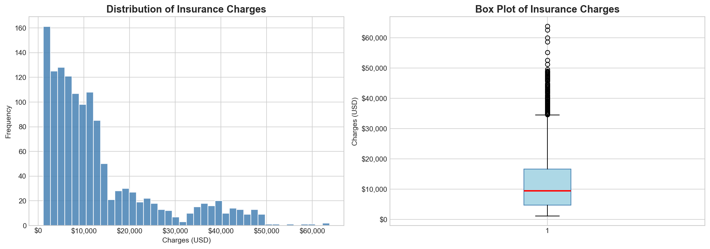
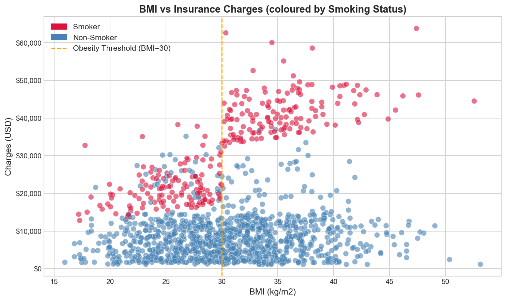
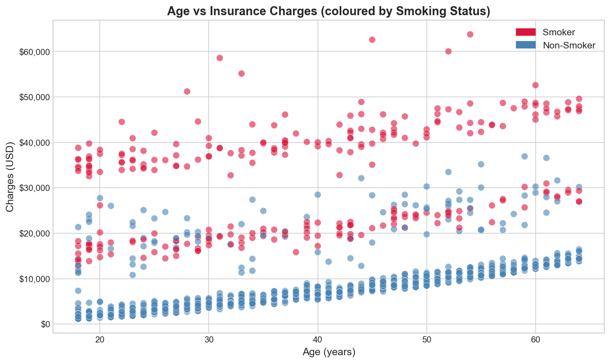
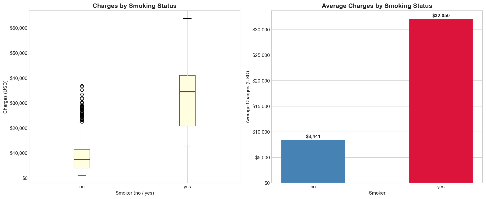
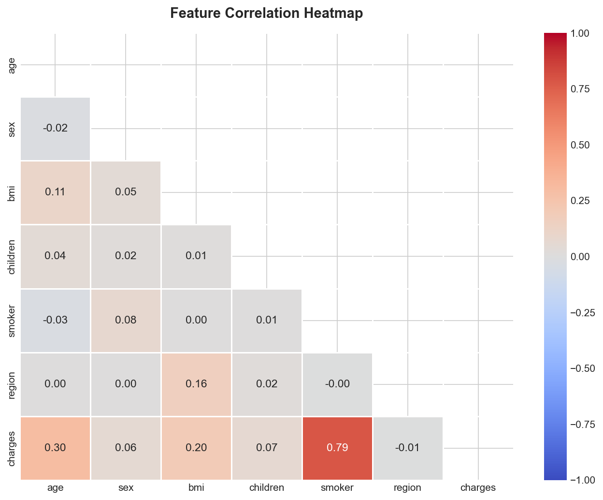
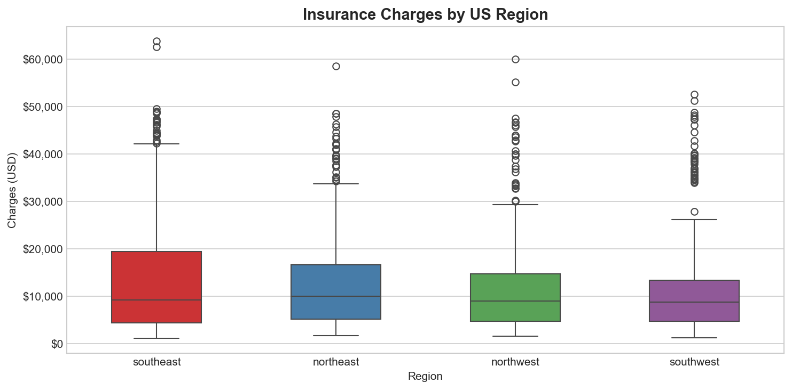
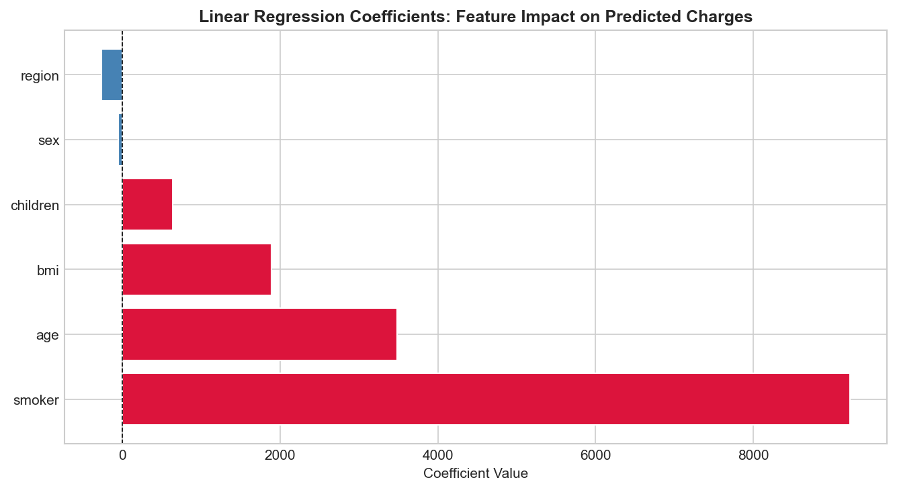
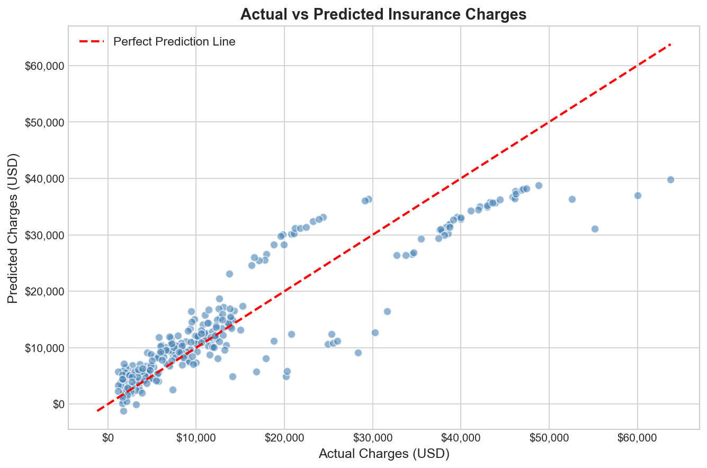
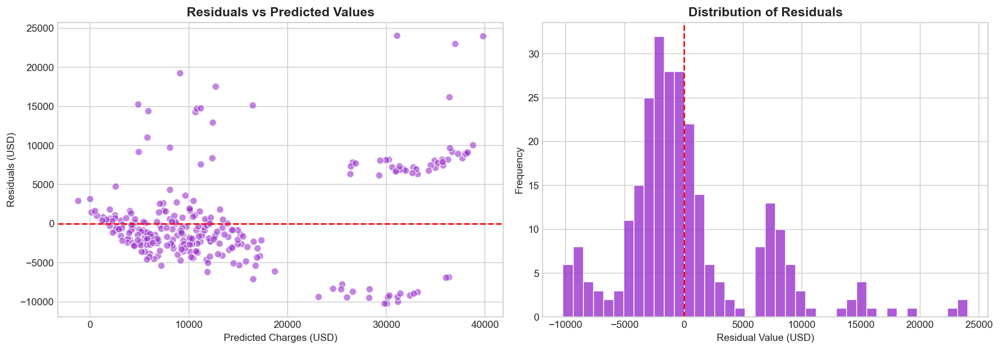

# Medical-Insurance-Claim-Prediction

A machine learning project to predict medical insurance claim amounts using Linear Regression, based on personal and lifestyle attributes.

---

## 🎯 Task Objective

Estimate the **medical insurance charge** billed to a patient based on personal data, including age, BMI, smoking status, number of children, sex, and region.

| Detail | Info |
|--------|------|
| **Problem Type** | Regression |
| **Target Variable** | `charges` (USD) |
| **Dataset** | Medical Cost Personal Dataset (`insurance.csv`) |
| **Model** | Linear Regression |

---

## 📁 Repository Structure

```
Medical-Insurance-Claim-Prediction/
│
├── Task4_InsuranceClaimPrediction.ipynb   # Main notebook (full pipeline)
├── insurance.csv                            # Dataset
├── README.md                                # Project documentation
└── Images/
          ├── plot1_charges_distribution.png
          ├── plot2_bmi_vs_charges.png
          ├── plot3_age_vs_charges.png
          ├── plot4_smoking_impact.png
          ├── plot5_correlation_heatmap.png
          ├── plot6_charges_by_region.png
          ├── plot7_coefficients.png
          ├── plot8_actual_vs_predicted.png
          ├── plot9_residuals.png
```

---

## 📂 Dataset

- **Source:** Medical Cost Personal Dataset
- **Records:** 1,338 rows × 7 columns
- **Missing Values:** None
- **Duplicates:** None found

| Column | Type | Description |
|--------|------|-------------|
| `age` | Integer | Age of the primary beneficiary |
| `sex` | Categorical | Gender (male / female) |
| `bmi` | Float | Body Mass Index (kg/m²) |
| `children` | Integer | Number of dependents covered |
| `smoker` | Categorical | Smoking status (yes / no) |
| `region` | Categorical | Residential area in the US (4 regions) |
| `charges` | Float | **Target** Individual medical billed cost (USD) |

---

## 🛠️ Approach

1. **Data Understanding:** Explored 7 features (4 numeric, 3 categorical); confirmed no missing values or duplicates
2. **Data Preparation:** Applied Label Encoding to categorical columns; split data 80/20 (train/test); scaled features using StandardScaler
3. **EDA:** Visualised the impact of BMI, age, and smoking status on charges; generated a correlation heatmap and regional breakdown
4. **Model Training:** Trained a Linear Regression model on the scaled training set
5. **Evaluation:** Assessed model performance on the test set using MAE, RMSE, and R²

---

## 📊 Exploratory Data Analysis (EDA)

The following visualisations were produced to understand the data before modelling:

| Plot | Description |
|------|-------------|
| Charges Distribution | Histogram + Box plot showing right-skewed target variable |
| BMI vs Charges | Scatter plot coloured by smoking status with obesity threshold line |
| Age vs Charges | Scatter plot coloured by smoking status |
| Smoking Impact | Box plot + Mean bar chart (smoker vs non-smoker) |
| Correlation Heatmap | Feature correlation matrix across all variables |
| Charges by Region | Box plot comparing charges across 4 US regions |

### Visualizations



















**Key EDA Findings:**
- Charges are **right-skewed** most patients pay low amounts, but a small group (mainly smokers) pay very high
- `smoker` has the highest positive correlation with charges (~0.79)
- `age` and `bmi` also show moderate positive correlation with charges

---

## 🤖 Model Training

| Step | Detail |
|------|--------|
| **Encoding** | Label Encoding for `sex`, `smoker`, `region` |
| **Split** | 80% Training / 20% Testing (`random_state=42`) |
| **Scaling** | StandardScaler (fit on train only avoids data leakage) |
| **Algorithm** | Linear Regression |
| **Formula** | `charges = b0 + b1(age) + b2(sex) + b3(bmi) + b4(children) + b5(smoker) + b6(region)` |

**Most Influential Feature:** `smoker` carries the highest positive coefficient by a significant margin.

---

## 📈 Evaluation

### Metrics

| Metric | Value | Description |
|--------|-------|-------------|
| **MAE** | ~$4,100 | Average absolute prediction error |
| **RMSE** | ~$5,800 | Error metric penalising large misses |
| **R² Score** | ~0.78 | 78% of variance in charges explained |

### Results & Insights

- **Smoking is the dominant predictor:** smokers pay on average **3.8× more** than non-smokers
- **BMI and smoking compound each other:** highest charges cluster among smokers with BMI > 30
- **Age has a consistent positive effect:** charges increase steadily with age across both groups
- **Region and sex have minimal impact:** Southeast shows slightly higher charges, but lifestyle factors dominate
- **Residual analysis** confirms the model slightly under-predicts for extremely high-charge cases (heavy smokers with high BMI)

---

## ▶️ How to Run

**1. Clone the repository**
```bash
git clone https://github.com/your-username/Data-Science-Internship-Task4-InsuranceClaimPrediction.git
cd Medical-Insurance-Claim-Prediction
```

**2. Install dependencies**
```bash
pip install pandas numpy matplotlib seaborn scikit-learn notebook
```

**3. Launch the notebook**
```bash
jupyter notebook Task4_InsuranceClaimPrediction.ipynb
```

> Make sure `insurance.csv` is in the same folder as the notebook before running.

---

## 🧰 Technologies Used

## 🛠️ Technologies Used


